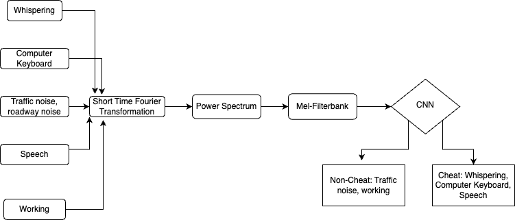
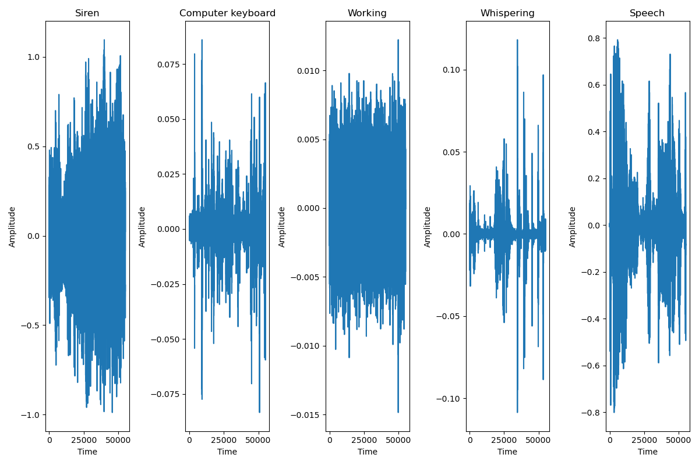
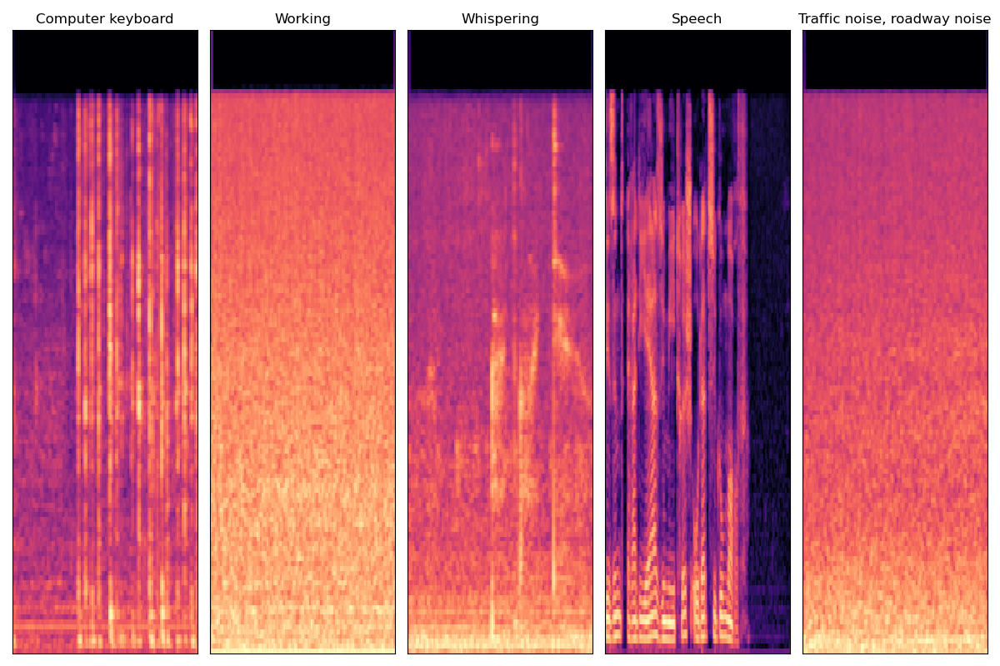
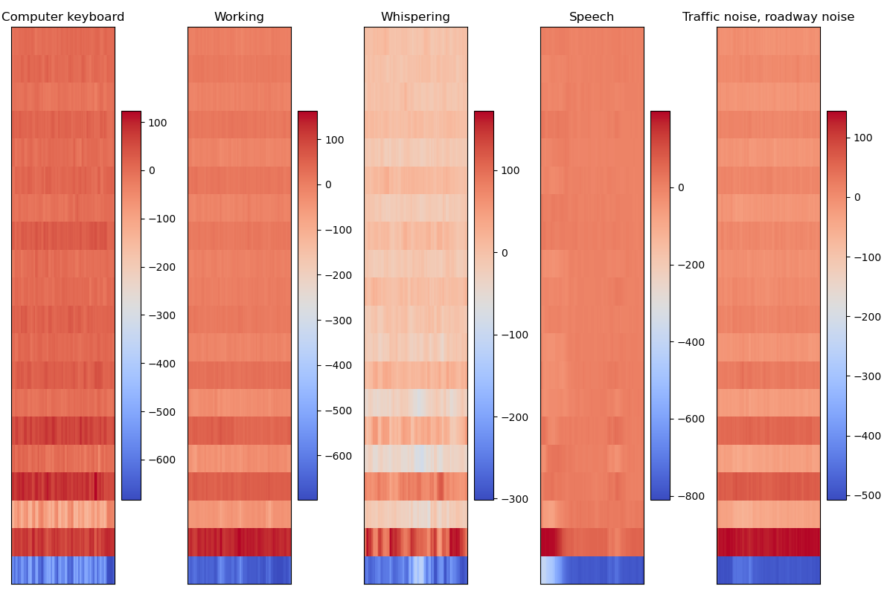

# Audio Detection and Classification to determine cheating behaviour using CNN
 
## Idea 

Transform audio signals with duration of 2.5 seconds from 5 categories: Computer Keyboard, Working, Whispering, Speech, Traffic noise and roadway noise into melspectrogram by applying STFT on overlapping windows, typically 25 ms with 10 ms stride, take the Power Spectrum and apply Mel-filterbanks. This melspectrogram is fed into the CNN to learn features and result in a model that can classify effectively this sound events. The melspectrogram are done by a package called Kapre as a direct input layer of the CNN.

## Dataset
Dataset are 1486 wavefiles with duration of 2.5 seconds collected from multiple sources: AudioSet by Google, ESC-50, and self-recorded. The data are time-shifted right and left randomly to increase variation to the data. 
### Wave signals: 

### Melspectrograms:

### MFCCs:

## Model performance
Model performed well during crossvalidation and during training. The model also achieved 99% precision and recall score and 95% for accuracy on a seperate never-before-seen test set. Run evaluate.py to see the scores. 
### Learning Curve: 
{:width="300px"}

## Citation 
1. [Speech Processing for Machine Learning: Filter banks, Mel-Frequency Cepstral Coefficients (MFCCs) and What's In-Between](https://haythamfayek.com/2016/04/21/speech-processing-for-machine-learning.html)
2. [Build a Deep Audio Classifier with Python and Tensorflow](https://youtu.be/ZLIPkmmDJAc)
3. [Deep Learning for Audio Classification (kapre version)](https://www.youtube.com/watch?v=RMfeYitdO-c&list=PLhA3b2k8R3t0SYW_MhWkWS5fWg-BlYqWn)
4. [Build a Deep CNN Image Classifier with ANY Images](https://youtu.be/jztwpsIzEGc)
5. [Audio Classification with Machine Learning (EuroPython 2019)](https://youtu.be/uCGROOUO_wY)
6. [Kapre: On-GPU Audio Preprocessing Layers for a Quick Implementation of Deep Neural Network Models with Keras](https://arxiv.org/abs/1706.05781)

