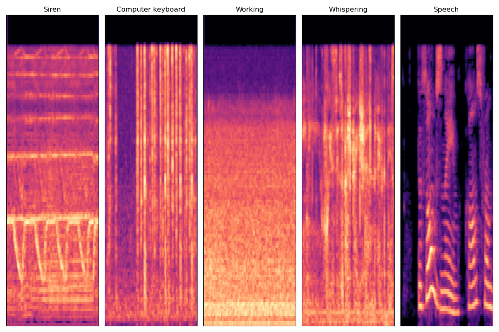
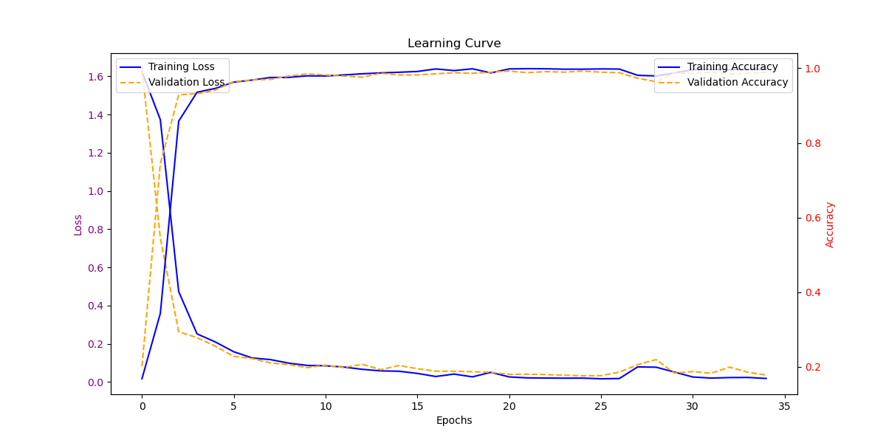

# Audio Detection and Classification to determine cheating behaviour using CNN
 
## Idea 

Transform audio signals with duration of 2.5 seconds from 5 categories: Computer Keyboard, Working, Whispering, Speech, Traffic noise and roadway noise into melspectrogram by applying STFT on overlapping windows, typically 25 ms with 10 ms stride, take the Power Spectrum and apply Mel-filterbanks. This melspectrogram is fed into the CNN to learn features and result in a model that can classify effectively this sound events. The melspectrogram are done by a package called Kapre as a direct input layer of the CNN.

<<<<<<< HEAD


## Dataset
Dataset are 1486 wavefiles with duration of 2.5 seconds collected from multiple sources: AudioSet by Google, ESC-50, and self-recorded. The data are time-shifted right and left randomly to increase variation to the data. 
### Wave signals: 

### Melspectrograms:

### MFCCs:


## Model performance
Model performed well during crossvalidation and during training. The model also achieved 99% precision and recall score and 95% for accuracy on a seperate never-before-seen test set. Run evaluate.py to see the scores. 
### Learning Curve: 


## Citation 
1. [Speech Processing for Machine Learning: Filter banks, Mel-Frequency Cepstral Coefficients (MFCCs) and What's In-Between](https://haythamfayek.com/2016/04/21/speech-processing-for-machine-learning.html)
2. [Build a Deep Audio Classifier with Python and Tensorflow](https://youtu.be/ZLIPkmmDJAc)
3. [Deep Learning for Audio Classification (kapre version)](https://www.youtube.com/watch?v=RMfeYitdO-c&list=PLhA3b2k8R3t0SYW_MhWkWS5fWg-BlYqWn)
4. [Build a Deep CNN Image Classifier with ANY Images](https://youtu.be/jztwpsIzEGc)
5. [Audio Classification with Machine Learning (EuroPython 2019)](https://youtu.be/uCGROOUO_wY)
6. [Kapre: On-GPU Audio Preprocessing Layers for a Quick Implementation of Deep Neural Network Models with Keras](https://arxiv.org/abs/1706.05781)
=======
Go to your local directory that you guys want save the project in the terminal and enter this line: 
```
git clone https://github.com/l-nguyen03/LfB-Institute-Project.git .
```
The repo here **_include the dockerfile also_** so that we all have the same dockerfile and can receive updated one if any changes are made so please **don't save it with the directory that has the same dockerfile that Ankit sent.** 

**_If you are using MacOS with Apple Silicon then go to the branch main-arm64 and clone this branch instead._**
>>>>>>> main


<<<<<<< HEAD

=======
1. Ali will clone the repository to his local machine using the git clone command. This will create a local copy of the repository on his machine.
2. He then creates a branch for his functionality with ``git branch branch-name`` followed by name of the functionality, ex. 
```
git branch face_regconition.
```
3. He now goes to his branch by using the command ``git checkout -b branch-name`` followed by name of the newly created branch.
4. He can now write code like normal and save it in the same directory as the git repo.
5. After he is done with the code, he can go to the terminal, he can type this command ``git add`` followed by ``git commit -m "some message"`` where message should explain what he has done, like "implemented facial comparison", or "add message forwarding". (remember that if you guys start a new working session, remember to always go to your branch first by using ``git branch your-branch-name`` before ``git add)
6. He then pushes his changes to remote branch. Use the ``git push origin your-branch-name`` command to push your changes to the remote branch.
7. He will then go to GitHub and create a pull request. Then the team can review his code and give feedbacks, then I will merge the code to main branch.
8. Once the changes are merged, everyone in the team can pull the updated code to their local machine by using ``git pull origin main``.

### Please only add, commit and push your Python codes. Only push your Dockerfile if you have changed it for others to review and update.

## GitHub and Git basic commands: 
1. ``git clone <url>`` - Clone a repository to your local machine.
2. ``git pull`` - Pull changes from the remote repository.
3. ``git push`` - Push changes to the remote repository.
4. ``git branch`` - List all branches in the repository.
5. ``git branch <branch>`` - Create a new branch.
6. ``git checkout <branch>`` - Switch to the specified branch.
7. ``git merge <branch>`` - Merge the specified branch into the current branch.
8. ``git init`` - Initialize a new Git repository in the current directory.
9. ``git add <file>`` - Add changes to the specified file to the staging area.
10. ``git add .`` - Add all changes to the staging area.
11. ``git commit -m "<message>"`` - Commit changes with the specified message.
12. ``git status`` - Display the current status of the repository.
13. ``git log`` - Show the commit history.
14. ``git diff <file>`` - Show the difference between the working directory and the last commit for the specified file.
15. ``git fetch`` - Fetch changes from the remote repository without merging them.
>>>>>>> main
